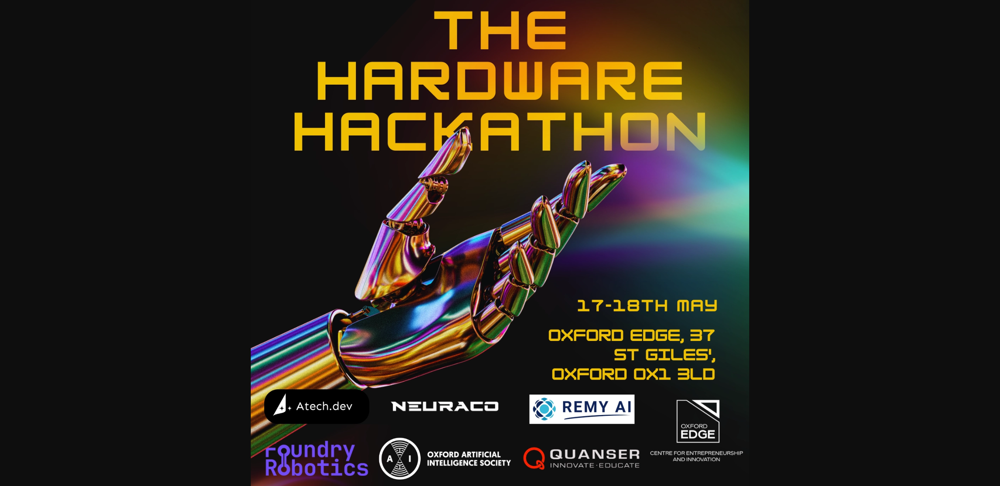
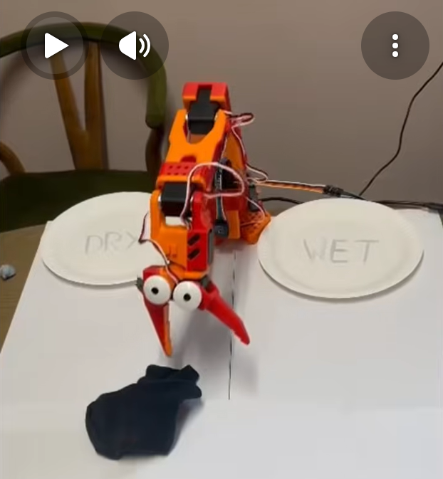
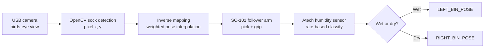
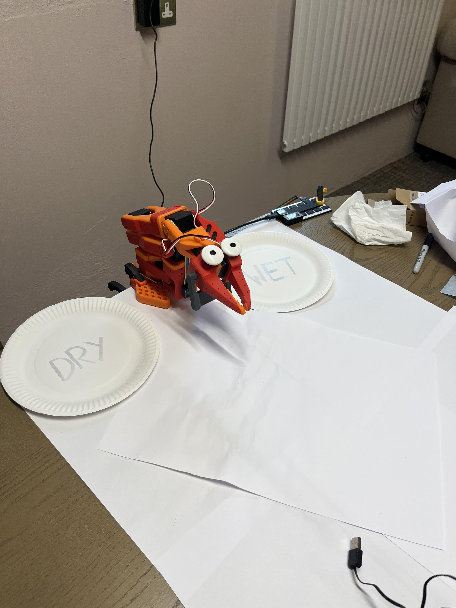
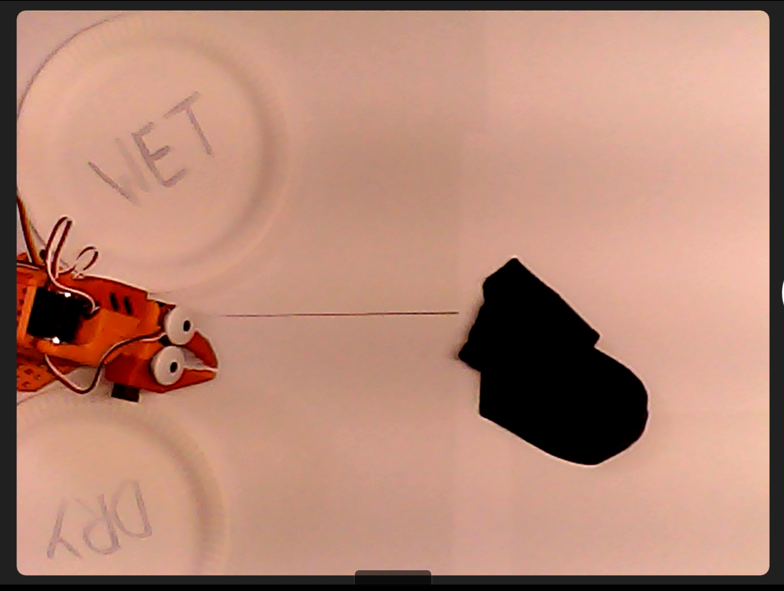
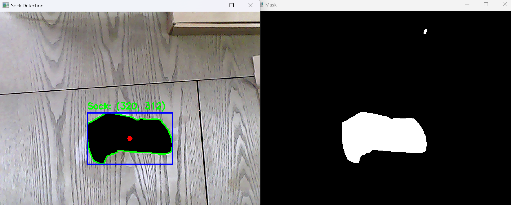
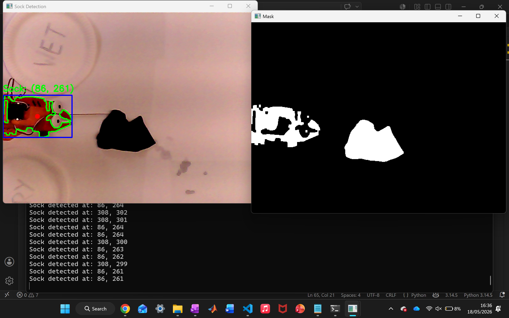

# Lobster Sort: Autonomous Robotic Arm Sorter (SO-101 Hackathon)

**Lobster Sort** is an autonomous clothes-sorting robot built on two 6-DOF [SO-101](https://github.com/TheRobotStudio/SO-ARM100) arms, a bird's-eye USB camera, and an [Atech.dev](https://atech.dev) humidity sensor. It detects as sock in the workspace, picks it up, measures moisture at a fixed sensor station, and deposits it into a **wet** or **dry** bin. The project was made for the physical AI hardware hackathon hosted by **Oxford Artificial Intelligence Society** & **Oxford Edge** with hardware from **Foundry Robotics, Quanser, Atech, Hugging Face LeRobot, LeKiwi,** & **Amazing Hand**. Coding credits from **Anthropic, Cursor, Neuracore,** & **Lovable**. Overall in a team of 5 (team name: Hermit), over the time of two days, with 16 hours of lab time we were able to sucessfully produce a live demo of the system for judging.

## Hackathon result:
**Winner**, *Best use of Atech.dev systems*.



## Next steps and reflections
The project was successful in developing a working demo before the deadline. This was cut close as we were initially planning on training the arm using neuracore AI infrastructure and imitation learning data from the leader arm however the data upload failed at the end of day 1 so the project had to be pivoted. Working with innovative AI technologies has given an insight into how the future of high efficiency robotics engineering might look and familiarity using these tools particularly working with AI agents within coding environments.

The robot use case can expand greatly. By switching out the humidity sensor **we have created a robotic system that can sort objects based on any sensed condition**, for example a camera can allow sorting ripe and unripe fruit by colout. Future improvements might include sensor fusion to test for multiple conditions or a convolutional neural network that can pinpoint any object and the end effector positions on the camera to allow for more accurate moevment of the end effector.


---

## Main demo (click to play)

[](https://www.youtube.com/shorts/__rTiI1dL4w)

**[Full submission video on YouTube](https://www.youtube.com/shorts/__rTiI1dL4w)** end-to-end pick: -> sense -> sort cycle.

---

## How it works



1. **Vision**: Grayscale thresholding finds the dark sock on a light background; largest contour above `5000` px² becomes the target (`detect_sock()` in `mainFINAL.py`).
2. **Reach**: Camera pixel `(sock_x, sock_y)` maps to five joint angles via **inverse distance-weighted interpolation** across five calibrated pixel↔pose pairs (`CALIBRATION`, `HOVER_OFFSET`, `REACH_OFFSET`).
3. **Manipulate**: Follower arm closes gripper (`set_gripper_open_value(0.0)`), moves to `SENSOR_POSE`, holds for measurement.
4. **Sense**: Atech module streams JSON over serial; humidity **rate of change** over `MEASURE_SECONDS` is compared to `HUM_THRESHOLD` -> `Wet` or `Dry`.
5. **Sort**: Arm moves to `LEFT_BIN_POSE` (wet) or `RIGHT_BIN_POSE` (dry), opens gripper, waits for **Enter** to repeat.

Entry point for the full pipeline: **`example_so101/examples/mainFINAL.py`**.

---

## Media

### Build & vision

| | |
|---|---|
|  | **Final build**: follower arm, overhead camera, sensor pad, wet/dry bins, and googly-eyed "lobster". |
|  | **Camera mount**: fixed overhead view of the workspace (640×480). |
|  | **Object detection**: contour, bounding box, and centroid logged as `(center_x, center_y)`. |
|  | **Camera issue**: early runs opened the laptop webcam (`VideoCapture(0)`); fixed by using index `1` and `CAP_DSHOW` on Windows. |

### Local test videos

Videos are stored in the [`Videos/`](Videos/) directory.

### Leader → follower teleop (development)

[Watch video](Videos/leader_follower_demo.mp4)

### Dry sock runs

[Dry test 1](Videos/dry_test1.mp4)
[Dry test 2](Videos/dry_test2.mp4)

### Wet sock run

[Watch wet test](Videos/wet_test.mp4)

---

## Repository layout

```
SO-101_Hackathon/
├── README.md                 ← this file (GitHub homepage)
├── README.txt                ← development log + quick reference
├── LICENCE.txt
├── Images/                   ← photos & YouTube thumbnail
├── Videos/                   ← local demo / test footage
├── example_so101/            ← all robot + vision + sort code
│   ├── so101_controller.py   ← follower arm API (joints, gripper, control loop)
│   ├── environment.yaml      ← conda env: so101-teleop
│   ├── so101_description/    ← URDF for visualization
│   └── examples/
│       ├── mainFINAL.py      ← ★ full autonomous sort loop
│       ├── main.py           ← pose-replay variant (poses.json, no camera)
│       ├── objectDetect.py   ← standalone sock detection preview
│       ├── move_to_sock.py   ← camera + interpolation test (press `m`)
│       ├── sock_calibrate.py ← workspace calibration tool
│       ├── record_poses.py   ← teach poses by hand -> poses.json
│       ├── play_poses.py     ← replay saved poses interactively
│       ├── sensor_according_to_rate.py  ← humidity-only test
│       ├── poses.json        ← saved joint poses (sensor, Lbin, Rbin, corners)
│       ├── 1_leader_arm_teleop_so101.py
│       ├── 2_collect_teleop_data_with_neuracore.py
│       └── common/
│           ├── configs.py    ← shared rates, camera index, neutral pose
│           └── sts3215_bus.py
└── neuracore/                ← vendored Neuracore SDK (teleop data logging)
```

---

## Hardware

| Device | Role | Typical port (ZenBook 14) |
|--------|------|---------------------------|
| SO-101 **leader** arm | Manual teleop / teaching | `COM4` |
| SO-101 **follower** arm | Autonomous sorting | `COM6` |
| Atech **humidity sensor** | Wet/dry classification | `COM7` |
| USB **webcam** | Overhead vision | OpenCV index `1` (fallback `0`) |

**Workspace:** White paper background under a fixed camera; dark sock for reliable `THRESH_BINARY_INV` segmentation.

---

## Software setup

### 1. Conda environment

```powershell
cd example_so101
conda env create -f environment.yaml
conda activate so101-teleop
```

Dependencies (`environment.yaml`): Python 3.10, `numpy`, `opencv-python`, `scservo-sdk`, `neuracore`, etc.

### 2. One-time motor calibration (LeRobot CLI)

```powershell
lerobot-find-port

lerobot-calibrate --teleop.type=so101_leader --teleop.port=COM4 --teleop.id=my_leader
lerobot-calibrate --robot.type=so101_follower --robot.port=COM6 --robot.id=my_follower_arm
```

### 4. Run full Lobster Sort demo

```powershell
cd example_so101\examples
python mainFINAL.py
```

**Controls:** Place sock -> **Enter** to start cycle -> **q** + **Enter** to quit.

---

## Key configuration variables

### `mainFINAL.py`: production demo

| Variable | Default | Purpose |
|----------|---------|---------|
| `PORT` | `"COM6"` | Follower arm serial port |
| `FOLLOWER_ID` | `"my_follower_arm"` | Calibration ID on disk |
| `SENSOR_PORT` | `"COM7"` | Atech sensor serial |
| `BASELINE_SECONDS` | `10` | Ambient humidity baseline at startup |
| `MEASURE_SECONDS` | `10` | Duration to average humidity rate at sensor |
| `HUM_THRESHOLD` | `0` | Rate threshold (%/s); `avg > threshold` -> **Wet** |
| `MOVE_SPEED` | `0.02` | Sleep between joint interpolation steps (s) |
| `STEP_SIZE` | `1.0` | Max joint step per frame (degrees) |
| `HOVER_OFFSET` | `250` | Added to joint[2], subtracted from joint[1]: lifts arm over table |
| `REACH_OFFSET` | `250` | Extends reach outward after hover adjustment |
| `SENSOR_POSE` | 5-vector | Joint angles at humidity pad (`closeSense` in `poses.json`) |
| `LEFT_BIN_POSE` | 5-vector | Wet bin (`Lbin`) |
| `RIGHT_BIN_POSE` | 5-vector | Dry bin (`Rbin`) |
| Gripper open / close | `0.5` / `0.0` | `set_gripper_open_value()`: 0 = closed, 1 = open |

**Vision (`detect_sock`):**

| Parameter | Value | Notes |
|-----------|-------|-------|
| Frame size | `640×480` | `cv2.resize` after capture |
| Camera index | `1` then `0` | `cv2.CAP_DSHOW` on Windows |
| Gaussian blur | `(5, 5)` | Noise reduction |
| Threshold | `80` | `THRESH_BINARY_INV` on blurred gray |
| Min contour area | `5000` | Ignores small blobs |

**Calibration (`CALIBRATION` list):** five `{pixel, pose}` pairs: inverse-distance weights:

```python
weight = 1.0 / max(||pixel_target - pixel_calib||, 1e-6)
joints = sum(weight_i * pose_i) / sum(weights)
# then apply HOVER_OFFSET and REACH_OFFSET on joints [1] and [2]
```

### `poses.json`: taught positions

| Key | Role |
|-----|------|
| `sensor` / `closeSense` | Above humidity sensor |
| `Lbin` | Wet bin |
| `Rbin` | Dry bin |
| `closeLow`, `farLow`, `farHigh`, `closeHigh` | Workspace corners for calibration |

Record new poses: `python record_poses.py` (torque off, move by hand, `s` to save).

---

## Design evolution (summary)

The project pivoted from Neuracore-based imitation learning to a **modular, rule-based** pipeline when cloud uploads stalled:

1. Leader/follower teleop and motor calibration (LeRobot).
2. Overhead camera + color segmentation for sock centroid.
3. Hand-taught poses -> `poses.json` -> `record_poses.py` / `play_poses.py`.
4. Pixel->joint mapping: bilinear (`sock_calibrate.py`) -> **distance-weighted** (`mainFINAL.py`) after camera mount was fixed.
5. Atech humidity **rate** classification integrated in a background `sensor_reader` thread.
6. Gripper, delays, and tunable `HOVER_OFFSET` / `REACH_OFFSET` / `HUM_THRESHOLD` for repeatable demos.

A CNN for end-effector tracking was considered; time constraints led to the fixed-camera + calibration approach, which was sufficient for the hackathon demo.

## License

Licenced under MIT. The `example_so101/` subtree includes its own [`LICENSE`](example_so101/LICENSE).

## Acknowledgements

- [The Robot Studio SO-ARM100 / SO-101](https://github.com/TheRobotStudio/SO-ARM100)
- [Hugging Face LeRobot](https://github.com/huggingface/lerobot): motor setup & calibration CLI
- [Atech.dev](https://atech.dev): humidity sensing
- [Neuracore](https://neuracore.ai): early teleop data logging exploration
